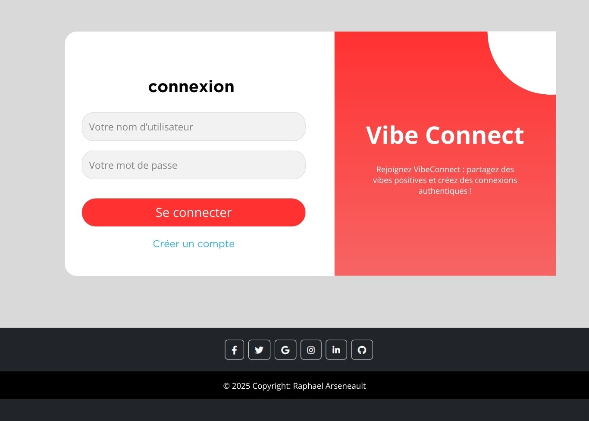
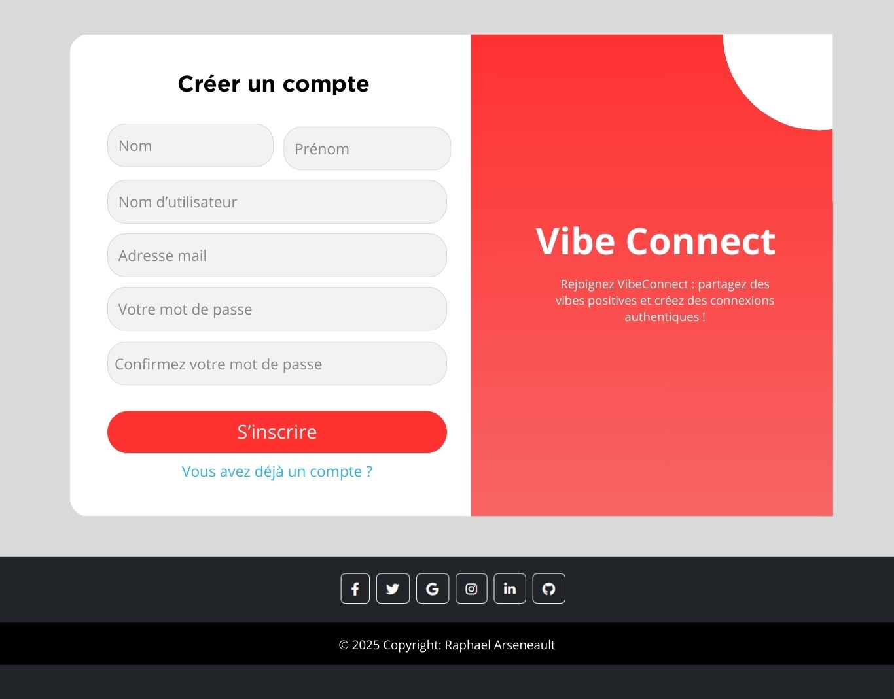
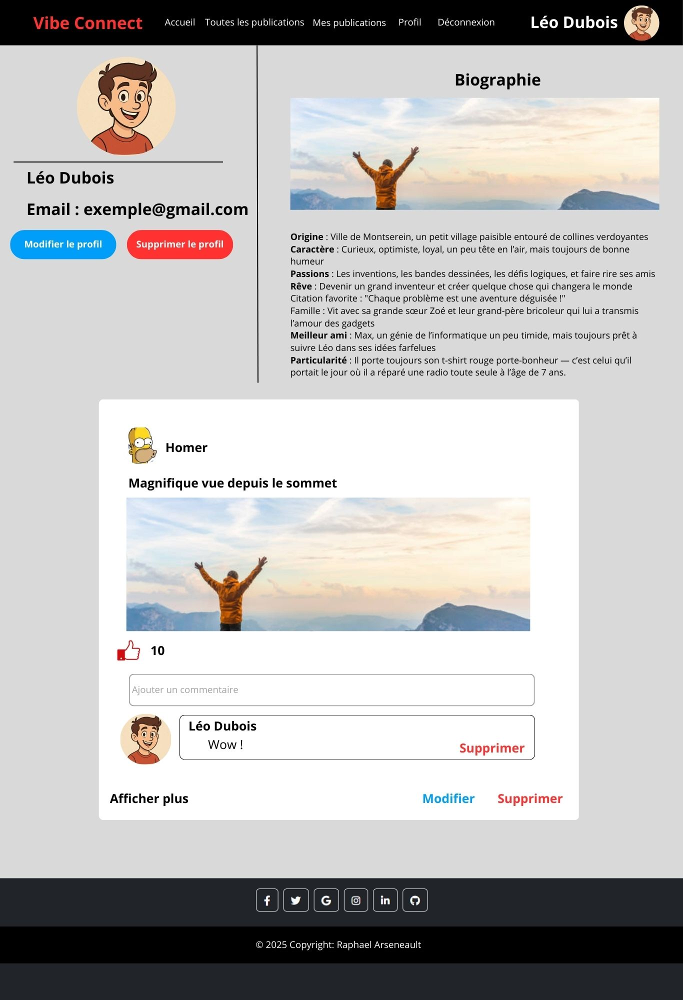
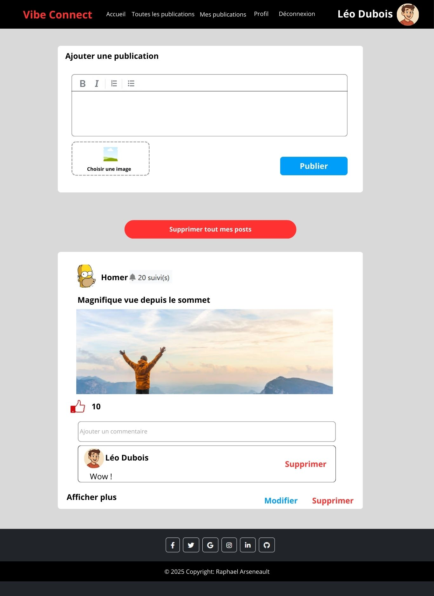
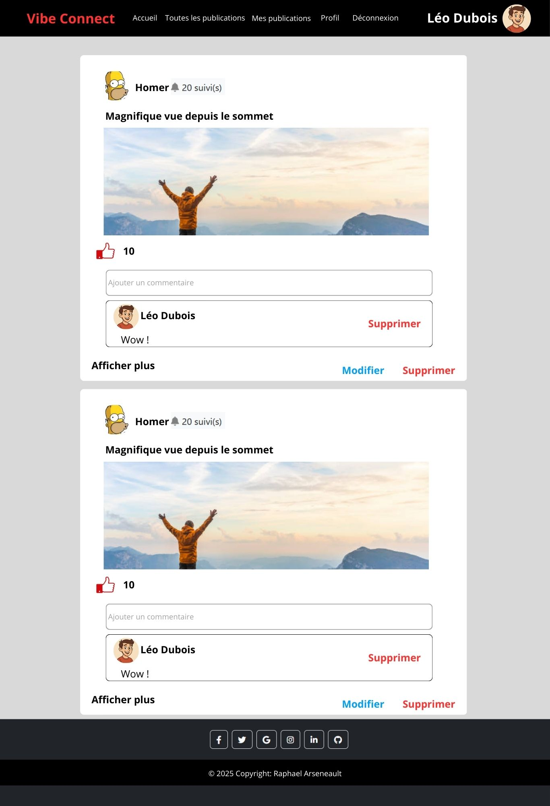

# VibeConnect

Social media web application built with React 18.

## Description

VibeConnect is a social media platform where users can:
- Create, edit, and delete posts with images
- Like and comment on posts
- Follow other users and view their posts
- Manage profiles with profile pictures and bio
- Support for French, English, and Spanish languages

## Installation

```bash
cd tp-integration-Zyphorah/vibeconnect
npm install
npm start
```

Application opens at http://localhost:3000

## Build for Production

```bash
npm run build
```

## Technologies

- React 18.2.0
- React Router DOM 7.5.3
- Bootstrap 5.3.5
- i18next (multi-language)
- React Markdown
- SweetAlert2
---

## UI Prototype Pages






